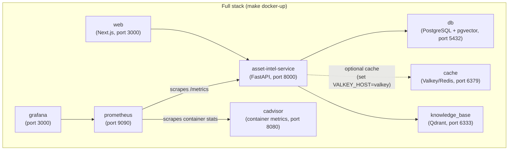

# Docker Services

```mermaid
graph TB
    subgraph stack["Full stack (make docker-up)"]
        web["web\n(Next.js, port 3000)"]
        asset-intel-service["asset-intel-service\n(FastAPI, port 8000)"]
        db["db\n(PostgreSQL + pgvector, port 5432)"]
        knowledge_base["knowledge_base\n(Qdrant, port 6333)"]
        cache["cache\n(Valkey/Redis, port 6379)"]
        prometheus["prometheus\n(port 9090)"]
        grafana["grafana\n(port 3000)"]
        cadvisor["cadvisor\n(container metrics, port 8080)"]
    end

    web --> asset-intel-service
    asset-intel-service --> db
    asset-intel-service -.->|"optional cache\n(set VALKEY_HOST=valkey)"| cache
    asset-intel-service --> knowledge_base
    prometheus -->|"scrapes /metrics"| asset-intel-service
    prometheus -->|"scrapes container stats"| cadvisor
    grafana --> prometheus
```
