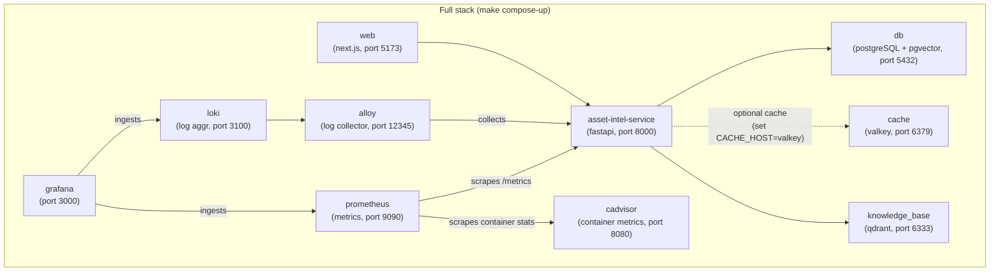

# Docker Services

```mermaid
graph TB
    subgraph stack["Full stack (make compose-up)"]
        web["web\n(next.js, port 5173)"]
        asset-intel-service["asset-intel-service\n(fastapi, port 8000)"]
        db["db\n(postgreSQL + pgvector, port 5432)"]
        knowledge_base["knowledge_base\n(qdrant, port 6333)"]
        cache["cache\n(valkey, port 6379)"]
        prometheus["prometheus\n(metrics, port 9090)"]
        grafana["grafana\n(port 3000)"]
        cadvisor["cadvisor\n(container metrics, port 8080)"]
        loki["loki\n(log aggr, port 3100)"]
        alloy["alloy\n(log collector, port 12345)"]
    end

    web --> asset-intel-service
    asset-intel-service --> db
    asset-intel-service -.->|"optional cache\n(set CACHE_HOST=valkey)"| cache
    asset-intel-service --> knowledge_base
    grafana -->|"ingests"| loki
    loki --> alloy
    alloy -->|"collects"| asset-intel-service
    grafana -->|"ingests"| prometheus
    prometheus -->|"scrapes /metrics"| asset-intel-service
    prometheus -->|"scrapes container stats"| cadvisor

```
