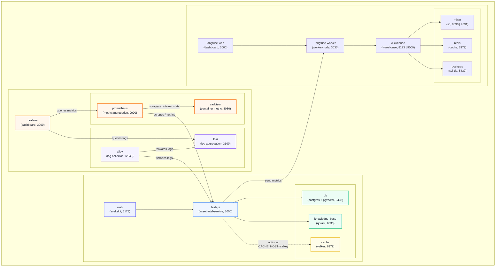

# Docker Services

```mermaid
graph TB

    %% =========================================================
    %% STACKS
    %% =========================================================
    subgraph stacks[" "]
        direction LR

        %% =========================================================
        %% APPLICATION STACK
        %% =========================================================
        subgraph app[" "]
            direction TB

            web["web\n(sveltekit, 5173)"]
            fastapi["fastapi\n(asset-intel-service, 8000)"]

            subgraph app_data[" "]
                direction LR
                db["db<br/>(postgres + pgvector, 5432)"]
                knowledge_base["knowledge_base<br/>(qdrant, 6333)"]
                cache["cache<br/>(valkey, 6379)"]
            end

            web --> fastapi

            fastapi --> db
            fastapi --> knowledge_base
            fastapi -.->|"optional<br/>CACHE_HOST=valkey"| cache
        end

        %% =========================================================
        %% OBSERVABILITY
        %% =========================================================
        subgraph obs[" "]
            direction TB

            grafana["grafana\n(dashboard, 3000)"]

            subgraph metric[" "]
                direction LR
                prometheus["prometheus\n(metric aggregation, 9090)"]
                cadvisor["cadvisor\n(container metric, 8080)"]
            end

            subgraph logging[" "]
                direction LR
                loki["loki<br/>(log aggregation, 3100)"]
                alloy["alloy<br/>(log collector, 12345)"]
            end

            grafana -->|"queries metrics"| prometheus
            prometheus -->|"scrapes container stats"| cadvisor
            grafana -->|"queries logs"| loki
            alloy -->|"forwards logs"| loki
        end

        %% =========================================================
        %% AI OBSERVABILITY
        %% =========================================================
        subgraph obs-ai[" "]
            direction TB

            langfuse-web["langfuse-web\n(dashboard, 3000)"]
            langfuse-worker["langfuse-worker\n(worker-node, 3030)"]
            clickhouse["clickhouse\n(warehouse, 8123 | 9000)"]

            subgraph data[" "]
                direction LR
                minio["minio<br/>(s3, 9090 | 9091)"]
                redis["redis<br/>(cache, 6379)"]
                postgres["postgres<br/>(sql-db, 5432)"]
            end

            langfuse-web --> langfuse-worker
            langfuse-worker -->clickhouse
            clickhouse --> minio
            clickhouse --> redis
            clickhouse --> postgres
        end
    end

    %% =========================================================
    %% CROSS-STACK CONNECTIONS
    %% =========================================================

    prometheus -->|"scrapes /metrics"| fastapi
    alloy -->|"scrapes logs"| fastapi
    fastapi -->|"send metrics"| langfuse-worker

    %% =========================================================
    %% STYLING
    %% =========================================================
    class web application
    class fastapi microservice
    class db,knowledge_base database
    class cache cache

    class prometheus,cadvisor metrics
    class grafana metrics
    class alloy,loki logs

    classDef application fill:#eef2ff,stroke:#6366f1,stroke-width:2px,color:#111827
    classDef microservice fill:#eff6ff,stroke:#3b82f6,stroke-width:2px,color:#111827
    classDef database fill:#ecfdf5,stroke:#10b981,stroke-width:2px,color:#111827
    classDef cache fill:#fefce8,stroke:#eab308,stroke-width:2px,color:#111827

    classDef metrics fill:#fff7ed,stroke:#f97316,stroke-width:2px,color:#111827
    classDef logs fill:#f5f3ff,stroke:#8b5cf6,stroke-width:2px,color:#111827
    classDef collector fill:#ecfeff,stroke:#06b6d4,stroke-width:2px,color:#111827

```
