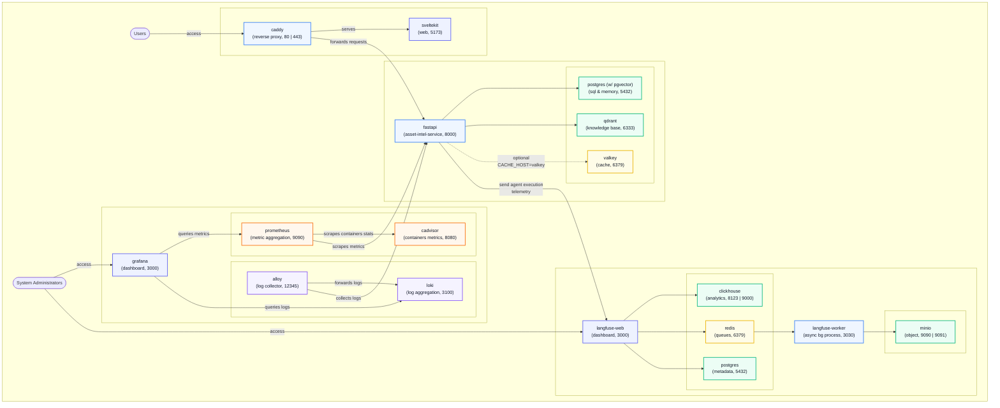

# Docker Services

```mermaid
graph TB
    %% =========================================================
    %% System
    %% =========================================================
    subgraph system[" "]
        direction LR

        Users([Users]) -->|access| caddy

        %% =========================================================
        %% APPLICATIONS STACK
        %% =========================================================
        subgraph apps[" "]
            direction TB

            sveltekit["sveltekit\n(web, 5173)"]
            caddy["caddy\n(reverse proxy, 80 | 443)"]

            caddy -->|"serves"| sveltekit
        end

        %% =========================================================
        %% SERVICES STACK
        %% =========================================================
        subgraph services[" "]
            direction TB

            fastapi["fastapi\n(asset-intel-service, 8000)"]

            subgraph services-data[" "]
                direction LR
                postgres+pgvector["postgres (w/ pgvector)<br/>(sql & memory, 5432)"]
                qdrant["qdrant<br/>(knowledge base, 6333)"]
                valkey["valkey<br/>(cache, 6379)"]
            end

            fastapi --> postgres+pgvector
            fastapi --> qdrant
            fastapi -.->|"optional<br/>CACHE_HOST=valkey"| valkey
        end

        SystemAdmins([System Administrators]) -->|access| grafana

        %% =========================================================
        %% OBSERVABILITY
        %% =========================================================
        subgraph obs[" "]
            direction TB

            grafana["grafana\n(dashboard, 3000)"]

            subgraph obs-metric[" "]
                direction LR
                prometheus["prometheus\n(metric aggregation, 9090)"]
                cadvisor["cadvisor\n(containers metrics, 8080)"]
            end

            subgraph obs-logging[" "]
                direction LR
                loki["loki<br/>(log aggregation, 3100)"]
                alloy["alloy<br/>(log collector, 12345)"]
            end

            grafana -->|"queries metrics"| prometheus
            prometheus -->|"scrapes containers stats"| cadvisor
            grafana -->|"queries logs"| loki
            alloy -->|"forwards logs"| loki
        end

        SystemAdmins([System Administrators]) -->|access| langfuse-web

        %% =========================================================
        %% AI OBSERVABILITY
        %% =========================================================
        subgraph obs-ai[" "]
            direction TB

            langfuse-web["langfuse-web\n(dashboard, 3000)"]

            subgraph obs_ai-data[" "]
                direction LR
                clickhouse["clickhouse\n(analytics, 8123 | 9000)"]
                redis["redis<br/>(queues, 6379)"]
                postgres["postgres<br/>(metadata, 5432)"]
            end

            langfuse-worker["langfuse-worker\n(async bg process, 3030)"]

            subgraph obs_ai-data2[" "]
                direction LR
                minio["minio<br/>(object, 9090 | 9091)"]
            end

            langfuse-web --> clickhouse
            langfuse-web --> redis
            langfuse-web --> postgres
            redis --> langfuse-worker
            langfuse-worker --> minio
        end
    end

    %% =========================================================
    %% CROSS-STACK CONNECTIONS
    %% =========================================================
    caddy -->|"forwards requests"| fastapi
    prometheus -->|"scrapes metrics"| fastapi
    alloy -->|"collects logs"| fastapi
    fastapi -->|"send agent execution<br>telemetry"| langfuse-web

    %% =========================================================
    %% STYLING
    %% =========================================================
    class sveltekit,grafana,langfuse-web application
    class caddy server
    class fastapi,langfuse-worker service
    class postgres+pgvector,postgres,qdrant,minio,clickhouse database
    class valkey,redis cache

    class prometheus,cadvisor metrics
    class alloy,loki logs

    classDef application fill:#eef2ff,stroke:#6366f1,stroke-width:2px,color:#111827
    classDef server fill:#eff6ff,stroke:#3b82f6,stroke-width:2px,color:#111827
    classDef service fill:#eff6ff,stroke:#3b82f6,stroke-width:2px,color:#111827
    classDef database fill:#ecfdf5,stroke:#10b981,stroke-width:2px,color:#111827
    classDef cache fill:#fefce8,stroke:#eab308,stroke-width:2px,color:#111827

    classDef metrics fill:#fff7ed,stroke:#f97316,stroke-width:2px,color:#111827
    classDef logs fill:#f5f3ff,stroke:#8b5cf6,stroke-width:2px,color:#111827

```
